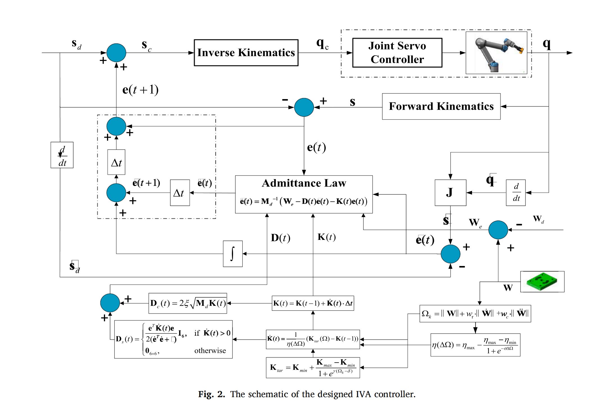
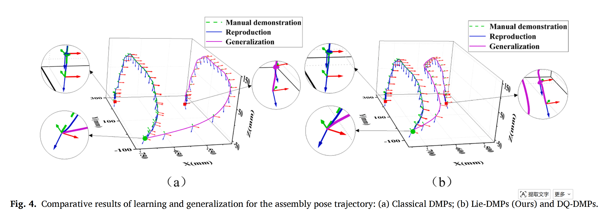

# Robotic Assembly Skill Learning

This repository provides the multimedia materials and figures for our study on robotic assembly, utilizing Lie-theory-based Dynamic Movement Primitives (Lie-DMPs) and an Improved Variable Admittance (IVA) controller.

## 🎥 Experimental Video

<video src="experiment.mp4" controls width="100%"></video>

---

## 📊 Core Methodology & Results

### 1. IVA Control Architecture
The proposed active compliance control scheme adjusts the assembly trajectory based on contact wrench feedback, which assists in reducing transient impact during the insertion phase.



### 2. Trajectory Generalization Comparison
A preliminary comparison illustrating the preservation of geometric features on $SE(3)$ when generalizing the demonstrated trajectory to new target poses.



---

## 📝 Citation

If this work is helpful to your research, we would appreciate it if you could cite our paper:

```bibtex
@article{fu2026robotic,
  title={Robotic assembly skill learning with lie-theory-based dynamic movement primitives and variable admittance control},
  author={Fu, Zhongtao and Li, Longhuan and Wang, Yujia and Spyrakos-Papastavridis, Emmanouil and Li, Miao and Chen, Xubing and Dai, Jian S.},
  journal={Mechanism and Machine Theory},
  volume={227},
  pages={106497},
  year={2026},
  publisher={Elsevier}
}
